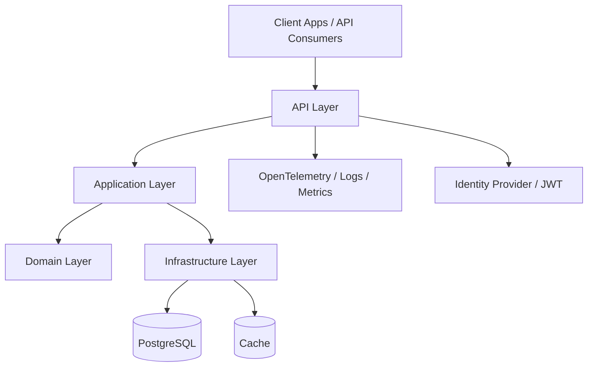

# .NET Critical Systems Template

> Public portfolio repository by **Mouad SAINDOU** — Engineering Leader focused on Digital Identity, eGovernment, Critical Systems and .NET platforms.

## 1. Context

This repository is part of a public GitHub portfolio designed to demonstrate architecture thinking, delivery maturity and engineering leadership without exposing private or sensitive systems.

**Repository type:** Code / Template

## 2. Objectives

Montrer une base .NET propre pour API critiques : Clean Architecture, sécurité, observabilité, tests et gouvernance technique.

Main objectives:

- Present a clean and reusable architecture vision.
- Explain key technical decisions and trade-offs.
- Make security, quality and observability visible from the beginning.
- Provide a professional documentation structure that can evolve over time.

## 3. Architecture overview

## 4. Stack / concepts

- .NET 9
- ASP.NET Core Minimal API
- Clean Architecture
- PostgreSQL
- OpenTelemetry
- Serilog
- xUnit
- Docker

## 5. Technical decisions

| Decision | Rationale |
|---|---|
| Keep the repository public but generic | Avoid exposing confidential business logic while demonstrating engineering maturity. |
| Document architecture before implementation | Make intent, constraints and trade-offs explicit. |
| Use ADRs for major decisions | Create a visible decision trail. |
| Treat security as a design concern | Avoid adding security as an afterthought. |
| Include limits and evolution paths | Show realistic thinking rather than artificial perfection. |

## 6. Security considerations

- No production secrets, credentials, customer data or private business rules.
- Diagrams and examples are intentionally generic or anonymized.
- Security topics are documented explicitly: identity, access control, audit, traceability, data protection and operational monitoring.

## 7. Quality and governance

This repository follows a lightweight governance model:

- structured README;
- documented decisions in `docs/decisions`;
- clear roadmap;
- review checklist before publication;
- progressive improvements through small commits.

## 8. Limits

This repository is not intended to be a full production system. It is a public architecture and engineering portfolio artifact. Some parts are simplified to keep the content understandable and safe to publish.

## 9. Evolution roadmap

- [x] ADR-0001: public repository scope.
- [x] ADR-0002: CQRS with MediatR.
- [x] ADR-0003: Outbox pattern for domain event reliability.
- [x] Architecture documentation: Clean Architecture, request flow, project structure.
- [x] Observability documentation: OpenTelemetry, Serilog, metrics, tracing, health checks.
- [x] Security documentation: JWT, ABAC, input validation, secrets, audit trail.
- [x] Testing strategy: unit, integration, contract, architecture tests, CI gates.
- [x] Domain scaffold: `Identity` aggregate, `NationalId` value object, domain events.
- [x] Application scaffold: `CreateIdentityCommand`, pipeline behaviours.
- [x] Unit tests: `IdentityTests`, `NationalIdTests`.
- [x] CI workflow: build, test, coverage gate, vulnerability scan, format check.
- [x] `global.json`, `Directory.Packages.props`, `.editorconfig`.
- [ ] Infrastructure scaffold: EF Core DbContext, `IdentityRepository`, outbox table migration.
- [ ] API scaffold: Minimal API endpoints, OpenAPI spec.
- [ ] Integration test project with Testcontainers.
- [ ] Architecture test project with NetArchTest.
- [ ] `docker-compose.yml` infra config files (OTel Collector, Prometheus, Tempo, Loki, Grafana).
- [ ] GitHub Actions CI badge in README.

## 10. Related repositories

- `digital-identity-architecture-blueprint`
- `dotnet-critical-systems-template`
- `engineering-leadership-playbook`
- `egov-integration-patterns`
- `observability-zero-trust-lab`
