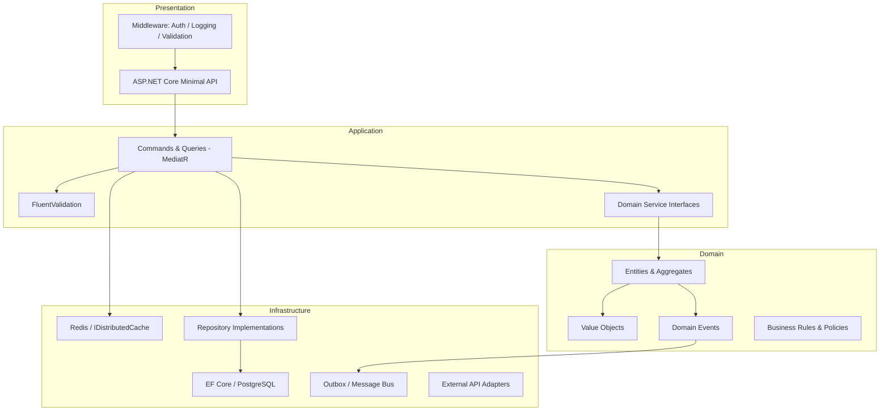
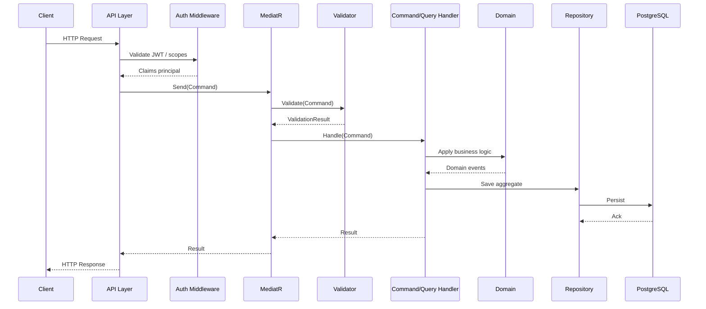

# Architecture

## Design intent

This template provides the structural and governance foundation for building .NET APIs that operate in critical contexts: high availability, auditability, security-sensitive data, regulatory compliance. The architecture enforces clean separation of concerns, explicit dependency rules and testability at every layer.

---

## Clean Architecture layers



### Dependency rule

> Inner layers must never reference outer layers. Dependencies always point inward.

| Layer | May depend on |
|---|---|
| Domain | Nothing (pure) |
| Application | Domain |
| Infrastructure | Application, Domain |
| Presentation (API) | Application |

---

## Request flow



---

## Project structure

```
src/
├── Api/                        # ASP.NET Core entry point, endpoint definitions
├── Application/                # Commands, queries, validators, interfaces
│   ├── Commands/
│   ├── Queries/
│   └── Common/                 # Behaviours (logging, validation, metrics)
├── Domain/                     # Entities, value objects, domain events, policies
└── Infrastructure/             # EF Core, Redis, messaging, external adapters
tests/
├── Unit/                       # Domain and Application layer unit tests
├── Integration/                # Database, cache, external adapter tests
└── Architecture/               # Dependency rule enforcement (NetArchTest)
```

---

## Key patterns

### CQRS with MediatR
Commands mutate state; queries return read models. This separation enables independent scaling, caching strategies and authorization rules per operation type.

### Outbox pattern
Domain events are persisted in an outbox table within the same transaction as the aggregate. A background publisher reads and dispatches them, guaranteeing at-least-once delivery without distributed transactions.

### Repository abstraction
Domain layer defines repository interfaces. Infrastructure provides implementations. The domain layer has zero dependency on EF Core.

### Pipeline behaviours
Cross-cutting concerns (logging, validation, performance metrics, retry) are implemented as MediatR pipeline behaviours and composed declaratively.

---

## ADRs

- [ADR-0001: Public repository scope](decisions/ADR-0001-public-repository-scope.md)
- ADR-0002: CQRS and MediatR adoption _(to be added)_
- ADR-0003: Outbox pattern for domain event reliability _(to be added)_
- ADR-0004: PostgreSQL as primary data store _(to be added)_
