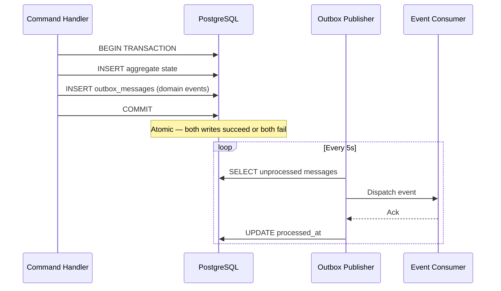

# ADR-0003 — Outbox Pattern for Domain Event Reliability

## Status

Accepted

## Context

When a command handler mutates an aggregate, it also generates domain events that must be dispatched to downstream consumers (audit log, notification service, integration events). There are two naive approaches, both flawed:

1. **Dispatch events before saving**: if the database write fails, events have been sent for a change that didn't happen — phantom events.
2. **Dispatch events after saving**: if the event dispatch fails (network error, message broker down), the state change is persisted but the events are lost — silent data inconsistency.

Both create subtle, hard-to-debug consistency bugs in critical systems. The root cause is the **dual-write problem**: writing to two different systems (database + message broker) without a distributed transaction.

## Decision

Implement the **Transactional Outbox pattern**:

1. Domain events are written to an `OutboxMessages` table **within the same database transaction** as the aggregate change.
2. A background **outbox publisher** (hosted service) polls the outbox table, dispatches events to consumers, and marks messages as processed.
3. Consumers must handle **at-least-once delivery** (idempotency key on each event).

### Database schema

```sql
CREATE TABLE outbox_messages (
    id              UUID        PRIMARY KEY DEFAULT gen_random_uuid(),
    occurred_at     TIMESTAMPTZ NOT NULL,
    type            TEXT        NOT NULL,
    payload         JSONB       NOT NULL,
    processed_at    TIMESTAMPTZ NULL,
    error           TEXT        NULL
);

CREATE INDEX idx_outbox_unprocessed
    ON outbox_messages (occurred_at)
    WHERE processed_at IS NULL;
```

### Outbox publisher behaviour

- Polls every **5 seconds** (configurable).
- Fetches up to **100 unprocessed messages** per batch, ordered by `occurred_at`.
- Dispatches each message in order; marks `processed_at` on success.
- On failure: increments an error counter, logs the error, retries up to 5 times with exponential backoff, then sets `error` and stops retrying (dead-letter).
- Publisher runs as a singleton `IHostedService`; only one instance is active (ensured via distributed lock or single-replica deployment).

### Flow diagram



## Alternatives considered

| Alternative | Reason rejected |
|---|---|
| Dispatch events in-memory after SaveChanges | Loses events on process crash or dispatch failure |
| Two-phase commit (XA transaction) | High complexity, poor library support in .NET, performance overhead |
| Change Data Capture (Debezium) | Valid for high-throughput scenarios; adds operational complexity not justified at current scale |
| Saga / choreography | Appropriate for multi-service workflows; overkill for single-service event dispatch |

## Consequences

- **Guaranteed at-least-once delivery**: no event is lost due to network failure or process crash.
- **No distributed transactions**: consistency is achieved through the single-database atomic write.
- **Operational overhead**: the outbox table must be monitored; dead-letter messages require alerting.
- **Latency**: events are dispatched asynchronously (up to 5 seconds after commit). Acceptable for audit and notification flows; not suitable for request/response patterns.
- **Idempotent consumers required**: consumers must handle duplicate delivery gracefully using the event `id` as an idempotency key.
