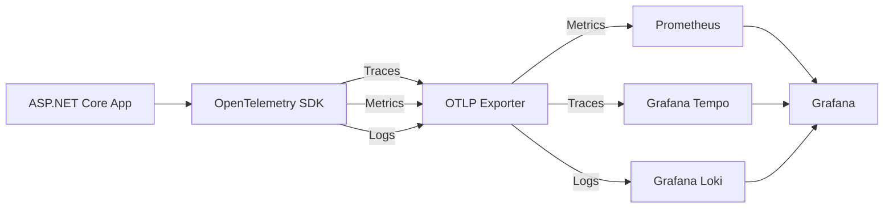

# Observability

## Philosophy

In critical systems, observability is not optional. You must be able to answer: _"What is the system doing right now? What happened 3 hours ago? Where is the bottleneck?"_ without SSH-ing into a server.

This template implements the **three pillars of observability** using OpenTelemetry as the vendor-neutral instrumentation layer.

---

## OpenTelemetry setup



### Configuration pattern (minimal)

```csharp
builder.Services.AddOpenTelemetry()
    .WithTracing(tracing => tracing
        .AddAspNetCoreInstrumentation()
        .AddEntityFrameworkCoreInstrumentation()
        .AddHttpClientInstrumentation()
        .AddOtlpExporter())
    .WithMetrics(metrics => metrics
        .AddAspNetCoreInstrumentation()
        .AddRuntimeInstrumentation()
        .AddOtlpExporter())
    .WithLogging(logging => logging
        .AddOtlpExporter());
```

---

## Structured logging

**Tool:** Serilog with enrichers and OTLP sink.

### Log levels and usage

| Level | When to use |
|---|---|
| `Debug` | Development-time detail. Never in production by default. |
| `Information` | Normal operations: request received, record created. |
| `Warning` | Unexpected but recoverable: retry triggered, validation failed. |
| `Error` | Operation failed, user-visible impact. Always include `Exception`. |
| `Fatal` | System cannot continue. Triggers immediate alert. |

### Mandatory log properties

Every log entry must include:

| Property | Source |
|---|---|
| `TraceId` | OpenTelemetry trace context |
| `SpanId` | OpenTelemetry span context |
| `CorrelationId` | From request header or generated |
| `UserId` | From JWT claims (if authenticated) |
| `Environment` | `ASPNETCORE_ENVIRONMENT` |
| `ServiceVersion` | From assembly version / build metadata |

### What NOT to log

- Passwords, tokens, secrets of any kind.
- Full request/response bodies containing PII.
- Credit card numbers, national identity numbers, biometric data.

---

## Metrics

### Standard metrics (auto-instrumented)

| Metric | Source |
|---|---|
| `http.server.request.duration` | ASP.NET Core instrumentation |
| `db.client.operation.duration` | EF Core instrumentation |
| `dotnet.gc.collections` | Runtime instrumentation |
| `dotnet.threadpool.threads` | Runtime instrumentation |

### Custom business metrics

Define domain-relevant counters and histograms using `System.Diagnostics.Metrics`:

```csharp
private static readonly Counter<long> _operationsProcessed =
    new Meter("MyService").CreateCounter<long>(
        "myservice.operations.processed",
        description: "Number of domain operations processed");
```

### SLO dashboard panels (Grafana)

| Panel | Query hint |
|---|---|
| Request rate | `rate(http_server_request_duration_count[5m])` |
| Error rate | `rate(http_server_request_duration_count{status_code=~"5.."}[5m])` |
| Latency p95 | `histogram_quantile(0.95, rate(...[5m]))` |
| DB query p95 | `histogram_quantile(0.95, rate(db_client_operation_duration_bucket[5m]))` |

---

## Distributed tracing

- Every incoming HTTP request creates a root span.
- All downstream calls (DB, cache, external APIs, message bus) create child spans.
- `CorrelationId` propagated via `traceparent` header (W3C Trace Context).
- Trace sampling: 100% in staging, 10% in production (head-based), with tail-based sampling for errors.

---

## Health checks

```csharp
builder.Services.AddHealthChecks()
    .AddNpgSql(connectionString, name: "postgres")
    .AddRedis(redisConnectionString, name: "redis")
    .AddUrlGroup(new Uri(externalApiUrl), name: "external-api");

app.MapHealthChecks("/health/live");    // Liveness: is the process up?
app.MapHealthChecks("/health/ready");   // Readiness: can it serve traffic?
```

- `/health/live` — checked by container orchestrator to restart on deadlock.
- `/health/ready` — checked by load balancer; removed from rotation when not ready.

---

## Alerting rules (reference)

| Alert | Condition | Severity |
|---|---|---|
| High error rate | Error rate > 1% for 5 min | P2 |
| High latency | p95 latency > 500 ms for 5 min | P2 |
| Service down | No healthy instances for 1 min | P1 |
| DB saturation | Connection pool > 80% for 3 min | P2 |
| Audit log failure | Any write failure to audit log | P1 |
