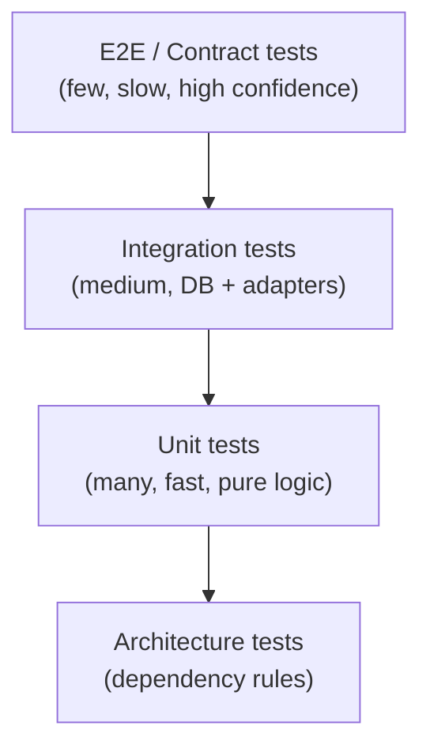

# Testing Strategy

## Principles

- Tests are **first-class code**: reviewed, maintained, and run in CI on every commit.
- The test suite is the **safety net for refactoring and dependency upgrades**.
- Tests must be **fast by default**: unit tests run in milliseconds; integration tests in seconds.
- A test that is never red is not a test.

---

## Test pyramid



---

## Unit tests

**Scope:** Domain layer and Application layer handlers in isolation.

**Tools:** xUnit, FluentAssertions, NSubstitute.

**Rules:**
- No I/O (no database, no network, no filesystem).
- All dependencies injected and substituted.
- One assertion concept per test; use `[Theory]` for data-driven cases.
- Test name format: `MethodName_StateUnderTest_ExpectedBehavior`.

```csharp
[Fact]
public void CreateIdentity_WithDuplicateNationalId_ThrowsDomainException()
{
    // Arrange
    var identity = Identity.Create(NationalId.From("AB12345678"));

    // Act
    var act = () => Identity.Create(NationalId.From("AB12345678"));

    // Assert
    act.Should().Throw<DuplicateIdentityException>()
       .WithMessage("*AB12345678*");
}
```

---

## Integration tests

**Scope:** Infrastructure layer — EF Core, PostgreSQL, Redis, external HTTP adapters.

**Tools:** xUnit, Testcontainers for .NET, WebApplicationFactory.

**Pattern:** Each test class spins up real containers (PostgreSQL, Redis) via Testcontainers. The test database is migrated fresh per class and cleaned per test.

```csharp
public class IdentityRepositoryTests : IAsyncLifetime
{
    private readonly PostgreSqlContainer _postgres =
        new PostgreSqlBuilder().Build();

    public async Task InitializeAsync() => await _postgres.StartAsync();
    public async Task DisposeAsync()    => await _postgres.DisposeAsync();

    [Fact]
    public async Task SaveAndReload_Identity_ReturnsSameState()
    {
        // Arrange
        var context = BuildContext(_postgres.GetConnectionString());
        var repo    = new IdentityRepository(context);
        var identity = Identity.Create(NationalId.From("AB12345678"));

        // Act
        await repo.AddAsync(identity);
        await context.SaveChangesAsync();
        var loaded = await repo.GetByNationalIdAsync(NationalId.From("AB12345678"));

        // Assert
        loaded.Should().NotBeNull();
        loaded!.NationalId.Value.Should().Be("AB12345678");
    }
}
```

---

## API / contract tests

**Scope:** Full HTTP stack via `WebApplicationFactory<Program>`.

**What to cover:**
- Happy paths: correct request → expected response shape and status code.
- Auth enforcement: unauthenticated request → `401`; insufficient scope → `403`.
- Validation: malformed input → `400` with structured error.
- Idempotency: duplicate request with same `Idempotency-Key` → same response, no duplicate.

---

## Architecture tests

**Tool:** NetArchTest.

**Purpose:** Enforce the Clean Architecture dependency rule automatically, preventing accidental coupling.

```csharp
[Fact]
public void Domain_ShouldNot_DependOnInfrastructure()
{
    var result = Types.InAssembly(DomainAssembly)
        .ShouldNot()
        .HaveDependencyOn("Infrastructure")
        .GetResult();

    result.IsSuccessful.Should().BeTrue();
}

[Fact]
public void Domain_ShouldNot_DependOnApplication()
{
    var result = Types.InAssembly(DomainAssembly)
        .ShouldNot()
        .HaveDependencyOn("Application")
        .GetResult();

    result.IsSuccessful.Should().BeTrue();
}
```

---

## Coverage targets

| Layer | Target coverage |
|---|---|
| Domain | ≥ 90 % |
| Application (handlers, validators) | ≥ 80 % |
| Infrastructure (repositories) | ≥ 70 % (covered by integration tests) |
| API endpoints | ≥ 80 % (covered by contract tests) |

Coverage is enforced in CI with `coverlet` + `ReportGenerator`. A build below threshold fails.

---

## CI gate summary

| Gate | Tool | Fail condition |
|---|---|---|
| Unit tests | xUnit | Any failure |
| Integration tests | xUnit + Testcontainers | Any failure |
| Architecture tests | NetArchTest | Any violation |
| Coverage | coverlet | Below threshold |
| Mutation score | Stryker.NET | Score < 70 % (optional) |
| Vulnerability scan | `dotnet list package --vulnerable` | High/Critical CVE |
